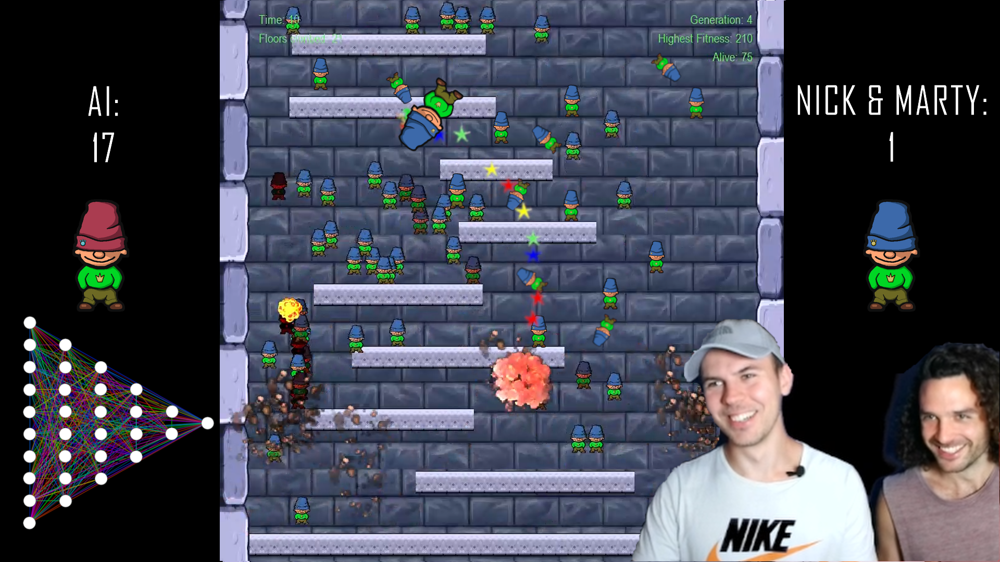
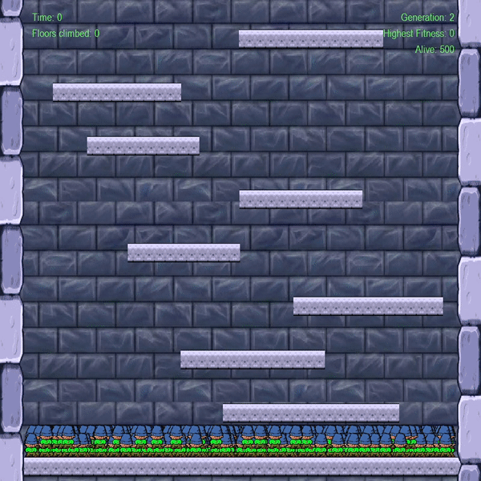

## About IcyAI

Hello Internet! Welcome to *icyAI* - a project for which I recreated the game Icy Tower in Python with Pygame and built an AI that learns how to play it.

[](https://youtu.be/W6qyRbmr_aA)

Click [here](https://youtu.be/W6qyRbmr_aA), to see what I did in this project on YouTube.

I made use of a genetic algorithm called NEAT. NEAT evolves neural network topologies through neuroevolution.
It is a known method from the domain of reinforcement learning. The concept is further explained in the video. You can also read the initial [NEAT paper](http://nn.cs.utexas.edu/downloads/papers/stanley.cec02.pdf) or browse through the [NEAT documentation](https://neat-python.readthedocs.io/en/latest/neat_overview.html).
This repository contains all files needed to train the AI for yourself. You can also let the trained AI play or compete against it in custom made modes of the game.



## Description

This repository (hopefully) contains everything you need to play the game for yourself or to train your own Icy Tower AI.
Feel free to play around with the configuration file. Maybe you'll find a way to make the AI learn even more complex behavior. I'd be curious to know about it in case you do.

## How to use

For playing the game:
```
py icyAI.py
```

For training an AI:
```
py icyAI.py name train n
```
- replace name with the name you want your model to be named
- replace n with the number after how many runs you want you model to be saved and stats to be saved

For letting a trained AI play:
```
py icyAI.py name play n
```
- replace name with the specific model that is supposed to play
- replace n with the number of times you want to let the AI play

For playing against a trained AI:

```
py icyAI.py name play n versus
```
- replace name with the specific model that is supposed to play against you
- replace n with the number of times you want to let the AI play against you

For adapting the screensize simply change the variable SCREEN_MAX in classes.py. Note that the game was made for size 900. With different sizes the physics might slightly change.
## Requirements and modules

- python 3
- pygame
- pickle
- neat
- sys
- os
- numpy
- random
- glob
- visualize
- re
- shutil
- time
- pynput.keyboard
